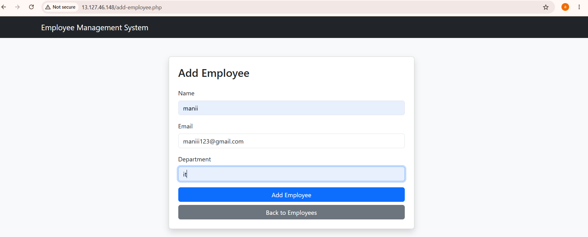
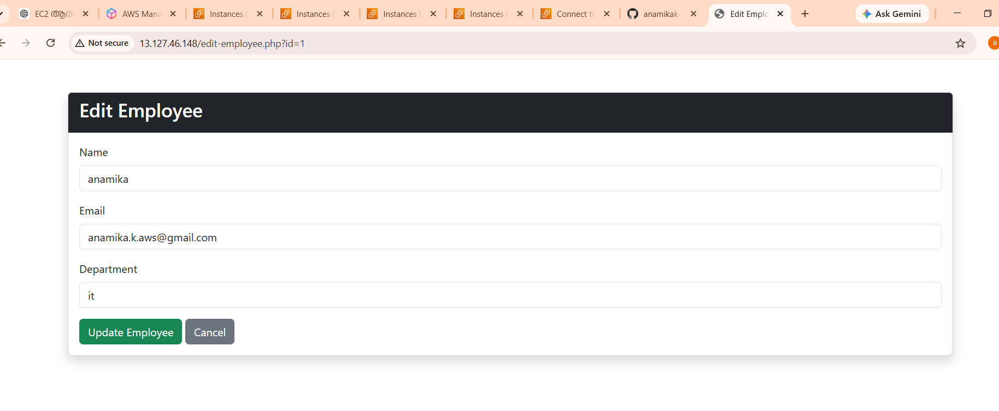
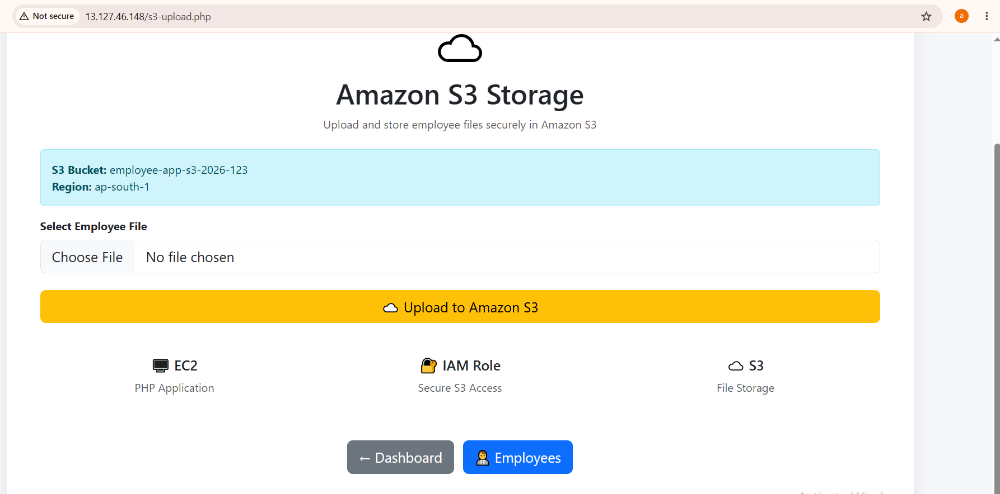

# Employee Management System

AWS-based Employee Management System built using PHP and AWS Cloud Services.

## Technologies Used

- PHP
- MySQL
- Bootstrap 5
- Composer
- AWS SDK for PHP

## AWS Services

- Amazon EC2 – Hosts the PHP application
- Amazon RDS – Stores employee data in MySQL
- Amazon S3 – Stores uploaded files
- AWS IAM – Provides secure permissions
- Amazon VPC – Provides network infrastructure

## Architecture

User Browser
↓
Amazon EC2
↓
Amazon RDS MySQL

Amazon EC2
↓
Amazon S3

## Features

- Add employees
- View employees
- Edit employees
- Delete employees
- Upload files to S3
- RDS database integration
- Bootstrap responsive UI

## Project Screenshots

### Dashboard

### Employees

### Add Employee

### Edit Employee

### S3 Upload

